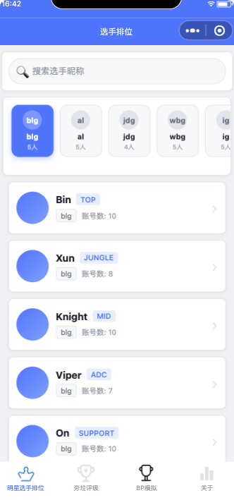
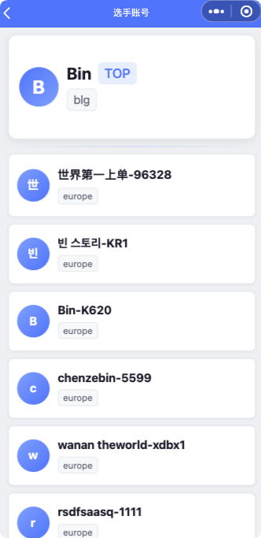
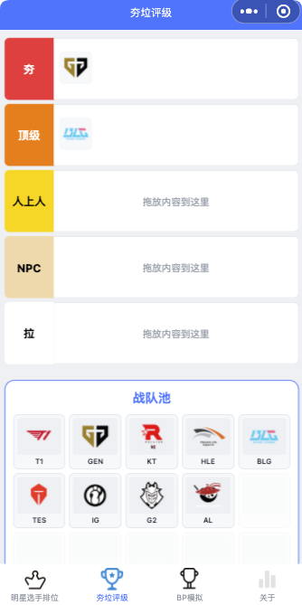
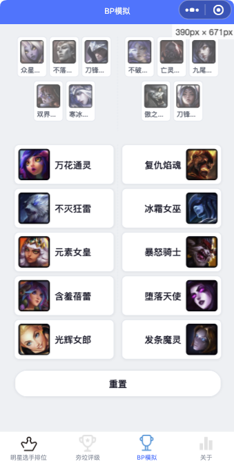

# OBGG WeChat Mini Program 

> **Notice for Riot Games API Reviewers:** This repository serves as the official Product URL for the **OBGG WeChat Mini Program** application. Since WeChat Mini Programs are part of a closed ecosystem in China and require a WeChat account to access, this repository provides high-resolution screenshots to demonstrate our fully functioning prototype and its live features.

## About The Project

OBGG is a comprehensive statistical analysis and companion tool designed specifically for League of Legends esports fans. Built by a 10-year dedicated fan of LoL esports (LPL and International events), this application aims to bring the esports community closer together by providing deep insights into professional players' Korean server Solo Queue stats, interactive tier lists, and a Pick & Ban simulator.

Our application strictly adheres to the Riot Games API General Policies. It is 100% free, securely manages API Keys via a backend proxy, and prominently displays the required legal boilerplate ensuring it is not endorsed by Riot Games.

### Product Description

`OBGG is a comprehensive statistical analysis and companion tool designed specifically for League of Legends esports fans within the WeChat Mini Program ecosystem. The product is designed to help players improve their own gameplay and deepen their understanding of the competitive meta by providing detailed stats, champion leaderboards, and a deep-dive into the Korean server Solo Queue match histories of top LCK/LPL professional players.`

`Our application also features interactive community tools, such as a subjective team tier-list creator and a fully functional Pick & Ban simulator, allowing fans to discuss strategies and share their drafts with friends. The APIs we are using are: match, summoner, champion, and league (to fetch rank and tier data).`

`As a dedicated League of Legends player and a passionate fan for over 10 years, I have never missed a single international tournament or LPL split. This application is built by a fan, for the fans. My ultimate goal is to channel my decade-long passion for LoL esports into a tool that brings the community closer together.`

`We strictly adhere to the General Policies, providing these services completely free of charge and seamlessly integrating the required legal boilerplate within our application. Our backend infrastructure is designed to proxy and securely store the API Key, ensuring it will never be exposed to the client-side WeChat Mini Program code.`

`Note: As our application runs exclusively inside the WeChat ecosystem (a closed platform in China), we have provided a GitHub repository link in the Product URL field (https://github.com/guokeke-code/OBGG-MiniProgram). It contains high-resolution screenshots to demonstrate our fully functioning prototype and its live features.`

## ✨ Core Features & Screenshots

### 1. Pro Player Tracking & Stats

Track top LCK/LPL professional players and deep-dive into their Korean server Solo Queue match histories (KDA, Champion picks, Win/Loss).

### 2. Interactive Team Tier List

A drag-and-drop feature allowing fans to create and share their own subjective tier lists of professional esports teams.

### 3. Pick & Ban Simulator

A fully functional Pick/Ban simulator for competitive matches, allowing users to select champions, simulate the draft phase, and export the final draft as a shareable image for community discussion.

## Legal Disclaimer

OBGG isn't endorsed by Riot Games and doesn't reflect the views or opinions of Riot Games or anyone officially involved in producing or managing Riot Games properties. Riot Games, and all associated properties are trademarks or registered trademarks of Riot Games, Inc.
